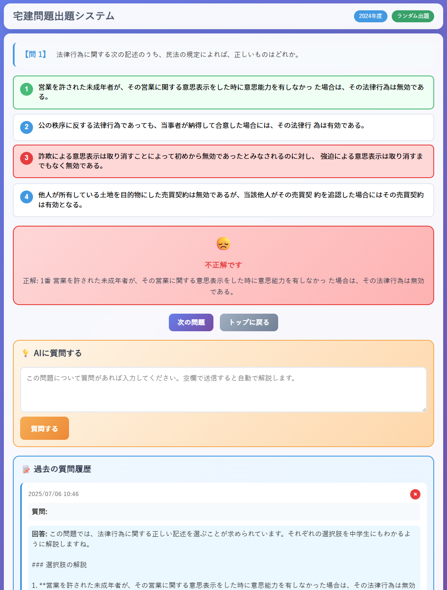

# Takken

## Overview
Takken is a comprehensive real estate license exam (宅建) question system built with PHP. It provides an interactive web-based platform for studying real estate license exam questions with AI-powered explanations, adaptive learning features, and detailed progress tracking.



## Features
- **Sequential and Random Question Modes**: Study questions in order or randomly by year
- **AI-Powered Explanations**: Get detailed explanations for questions using OpenAI GPT-4o-mini
- **Adaptive Learning**: System prioritizes questions with lower correct rates for focused study
- **Answer History Tracking**: Track your performance and identify weak areas
- **Responsive Design**: Works seamlessly on desktop and mobile devices
- **Basic Authentication**: Secure access with username/password protection
- **Progress Analytics**: View detailed statistics of your learning progress

## Installation

### Prerequisites
- PHP 7.4 or higher
- SQLite3 extension for PHP
- Web server (Apache/Nginx)
- OpenAI API key

### Step-by-step Installation

1. Clone the repository:
```bash
git clone https://github.com/daishir0/takken.git
cd takken
```

2. Set up configuration:
```bash
cp config.php.sample config.php
```

3. Edit `config.php` and configure the following:
   - Set your Basic authentication credentials (`AUTH_USERNAME`, `AUTH_PASSWORD`)
   - Add your OpenAI API key (`OPENAI_API_KEY`)
   - Adjust other settings as needed

4. Set proper permissions for the database and logs:
```bash
chmod 666 questions.db
chmod 755 logs/
chmod 666 logs/*.log
```

5. Deploy to your web server:
   - Copy all files to your web server document root
   - Ensure PHP has read/write permissions to the database file and logs directory

6. Access the application:
   - Open your web browser and navigate to the installation URL
   - Log in with the credentials you set in `config.php`

## Usage

### Basic Usage
1. **Login**: Enter your username and password (configured in `config.php`)
2. **Select Mode**: Choose between Sequential or Random question modes
3. **Answer Questions**: Read questions carefully and select your answer
4. **Get AI Explanations**: Click the "AI質問" button for detailed explanations
5. **Track Progress**: View your answer history and performance statistics

### Question Modes
- **Sequential Mode**: Study questions in numerical order from question 1
- **Random Mode**: Study random questions filtered by year (2020-2024)

### AI Features
- Ask questions about specific problems for detailed explanations
- Get clarification on legal concepts and terminology
- Receive study tips and memory aids

### Progress Tracking
- View correct/incorrect answer ratios
- See which questions you've answered before
- Delete individual question history items
- Adaptive learning prioritizes difficult questions

## Notes

### Configuration
- The system uses SQLite database for storing questions and user progress
- All sensitive configuration should be done in `config.php`
- Debug mode can be enabled/disabled in the configuration file

### Database
- The `questions.db` file contains all exam questions and user data
- Automatic table initialization occurs on first run
- Regular backups of the database file are recommended

### Security
- Basic HTTP authentication is used for access control
- API keys and credentials are stored in configuration files
- Ensure proper file permissions are set on production servers

### Performance
- The system is optimized for single-user or small group usage
- Large-scale deployment may require additional optimization
- AI API calls may have rate limits depending on your OpenAI plan

## License
This project is licensed under the MIT License - see the LICENSE file for details.

---

# Takken

## 概要
Takkenは、PHPで構築された包括的な宅建（宅地建物取引士）試験問題システムです。AI搭載の解説機能、適応学習機能、詳細な進捗追跡機能を備えた、インタラクティブなWeb学習プラットフォームを提供します。

## 機能
- **順次・ランダム問題モード**: 順番通りまたは年度別ランダムで問題を学習
- **AI搭載解説機能**: OpenAI GPT-4o-miniを使用した詳細な問題解説
- **適応学習**: 正答率の低い問題を優先的に出題する集中学習
- **回答履歴追跡**: パフォーマンスを追跡し、弱点分野を特定
- **レスポンシブデザイン**: デスクトップとモバイルでシームレスに動作
- **Basic認証**: ユーザー名/パスワードによる安全なアクセス制御
- **進捗分析**: 学習進捗の詳細統計を表示

## インストール方法

### 前提条件
- PHP 7.4以上
- PHP用SQLite3拡張機能
- Webサーバー（Apache/Nginx）
- OpenAI APIキー

### Step by stepのインストール方法

1. リポジトリをクローン:
```bash
git clone https://github.com/daishir0/takken.git
cd takken
```

2. 設定ファイルをセットアップ:
```bash
cp config.php.sample config.php
```

3. `config.php`を編集して以下を設定:
   - Basic認証の認証情報を設定（`AUTH_USERNAME`, `AUTH_PASSWORD`）
   - OpenAI APIキーを追加（`OPENAI_API_KEY`）
   - 必要に応じて他の設定を調整

4. データベースとログの適切な権限を設定:
```bash
chmod 666 questions.db
chmod 755 logs/
chmod 666 logs/*.log
```

5. Webサーバーにデプロイ:
   - すべてのファイルをWebサーバーのドキュメントルートにコピー
   - PHPがデータベースファイルとログディレクトリに読み書き権限を持つことを確認

6. アプリケーションにアクセス:
   - Webブラウザでインストール先URLを開く
   - `config.php`で設定した認証情報でログイン

## 使い方

### 基本的な使い方
1. **ログイン**: ユーザー名とパスワードを入力（`config.php`で設定）
2. **モード選択**: 順次問題モードまたはランダム問題モードを選択
3. **問題回答**: 問題を注意深く読み、回答を選択
4. **AI解説取得**: 「AI質問」ボタンをクリックして詳細な解説を取得
5. **進捗追跡**: 回答履歴とパフォーマンス統計を確認

### 問題モード
- **順次モード**: 問題1から順番に問題を学習
- **ランダムモード**: 年度別（2020-2024年）にフィルタリングされたランダム問題を学習

### AI機能
- 特定の問題について詳細な解説を質問
- 法的概念や専門用語の説明を取得
- 学習のコツや記憶法のアドバイスを受ける

### 進捗追跡
- 正解/不正解の比率を表示
- 以前に回答した問題を確認
- 個別の問題履歴項目を削除
- 適応学習により難しい問題を優先的に出題

## 注意点

### 設定
- システムはSQLiteデータベースを使用して問題とユーザー進捗を保存
- すべての機密設定は`config.php`で行う必要があります
- デバッグモードは設定ファイルで有効/無効を切り替え可能

### データベース
- `questions.db`ファイルにすべての試験問題とユーザーデータが含まれます
- 初回実行時に自動的にテーブル初期化が行われます
- データベースファイルの定期的なバックアップを推奨

### セキュリティ
- アクセス制御にはBasic HTTP認証を使用
- APIキーと認証情報は設定ファイルに保存
- 本番サーバーでは適切なファイル権限の設定を確保

### パフォーマンス
- システムは単一ユーザーまたは小規模グループでの使用に最適化
- 大規模展開には追加の最適化が必要な場合があります
- AI API呼び出しはOpenAIプランに応じてレート制限がある場合があります

## ライセンス
このプロジェクトはMITライセンスの下でライセンスされています。詳細はLICENSEファイルを参照してください。